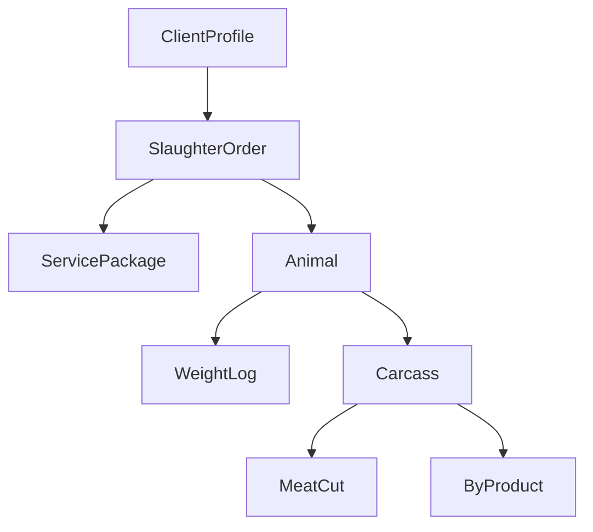

# Slaughterhouse Management System – Project-Level Design Plan

This document defines the high-level architecture, core concepts, and business workflow of the Slaughterhouse Management System. It is intended as the master blueprint for all app-level designs.

The system is built on **Django**, following a modular architecture where each app represents a distinct business domain.

## 1. Project Principles

*   **Modularity** – Each app has a single, well-defined responsibility.
*   **Clear APIs** – Apps interact via service functions or API endpoints with minimal coupling.
*   **Test-Driven Development** – All new functionality is accompanied by unit and integration tests.
*   **Agent-Friendly** – Code and documentation are designed for easy AI-assisted development and maintenance.
*   **Scalability** – Designed to handle multiple animal types, flexible service offerings, and future automation.
*   **Compliance-Ready** – Built to support traceability, regulatory, and hygiene reporting requirements.

## 2. App Architecture Overview

| App Name | Responsibility | Key Entities / Concepts |
| :--- | :--- | :--- |
| `users` | User authentication, authorization, role management, client profiles. | `User`, `ClientProfile` |
| `reception` | Client intake, order creation, and service package selection. | `SlaughterOrder`, `ServicePackage` |
| `processing` | Tracks animals from intake to carcass production. Handles weighing, identification, and status transitions. | `Animal`, `AnimalBatch`, `WeightLog` |
| `inventory` | Manages post-slaughter assets, packaging, storage, and disposition. | `MeatCut`, `ByProduct`, `StorageLocation` |
| `labeling` | Generates and prints labels for assets, integrated with barcode/RFID systems. | `Barcode`, `RFID`, `LabelTemplate` |
| `portal` | Read-only client-facing dashboard for tracking orders, asset statuses, and document downloads. | `OrderStatus`, `DocumentDownloads` |
| `reporting` | Generates internal and compliance reports, dashboards, and performance analytics. | `Report`, `Dashboard`, `Analytics` |
| `core` | Shared utilities, abstract base models, constants, permissions, and workflow helpers. | Abstract models, constants, helpers |

## 3. High-Level Business Workflow

The workflow adapts dynamically to the `ServicePackage` chosen by the client. The core steps are:

1.  **Reception – Order Creation**
    *   Clerk creates a `SlaughterOrder` for a client (new or existing).
    *   Selects a `ServicePackage` (slaughter only, full processing, packaging, labeling, etc.).
    *   Defines animal details (species, quantity, identification tags).
2.  **Animal Intake & Tracking (`processing`)**
    *   Each animal is logged as an `Animal` or part of an `AnimalBatch` (for small livestock).
    *   Identification assigned (ear tag, microchip, batch ID).
    *   Initial `WeightLog` recorded.
    *   Workflow engine sets animal’s initial status to `RECEIVED`.
3.  **Processing & Slaughter**
    *   Animal status transitions through defined states (e.g., `SLAUGHTERED`, `CARCASS_READY`).
    *   Additional weighing after slaughter.
    *   Carcass yield % calculated.
4.  **Conditional Post-Processing (`inventory`)**
    *   Based on the `ServicePackage`, carcasses are:
        *   Broken into **MeatCut**s.
        *   Processed into **ByProduct**s and Offal.
        *   Packaged and labeled.
        *   Assets assigned to a `StorageLocation`.
5.  **Labeling**
    *   The `labeling` app generates barcodes/QR/RFID labels.
    *   Labels are linked to the asset ID and workflow stage.
6.  **Client Monitoring (`portal`)**
    *   Clients track real-time progress.
    *   Downloadable invoices, certificates, and yield reports.
7.  **Reporting**
    *   **Operational Reports**: Throughput, yield %, downtime.
    *   **Compliance Reports**: Traceability logs, slaughter certificates.
    *   **Financial Reports**: Service revenue, cost breakdown.

## 4. Key Design Considerations

### 4.1 Service Flexibility

The `ServicePackage` is stored in the database with configurable:
*   Processing steps
*   Packaging requirements
*   Labeling rules

This allows adding new services without code changes.

### 4.2 Traceability

Every animal and product has a unique identifier, ensuring a full chain of custody from intake to final disposition.

### 4.3 Weighing

The system supports individual and group weighing. Logs are context-aware (pre-slaughter, post-slaughter, etc.) and automatically calculate yield.

### 4.4 Inventory

Supports various packaging units and multiple storage locations, enabling tracking by physical location within the facility.

### 4.5 Security

Features role-based access control (Clerk, Butcher, Manager, Client) and maintains audit logs for all data changes.

### 4.6 Automation Readiness

Includes API hooks for integrating with:
*   IoT scales
*   RFID/barcode scanners
*   Cold storage monitoring systems.

## 5. Example Entity Relationship Overview

_(Simplified conceptual model)_

